# 🏃‍♂️ Bin-Go: Sector Routing Algorithm for LBS
> **Heuristic Round-Trip Routing System based on Urban POI Data**  
> *Refactored repository focusing on Backend Logic & Algorithm Design*

## Demo (Algorithm Output)


*Example outputs of the sector-based routing algorithm.
Routes are generated as round-trip courses with distance constraints and
facility-aware waypoints under real-world POI sparsity.*

---

## 📌 Project Overview & Context
This repository is a **portfolio-oriented refactoring** of the team project **Bin-Go**, developed by **SWU Guru2 Team 2**.  
The original project is an Android-based running course recommendation app using Seoul public POI data.

I participated as **Main Algorithm Designer & Backend Developer**, focusing on **route generation logic, heuristic optimization, and server-side architecture**.

> **Note**  
> This is a mirror of the original team project repository.  
> This version highlights my specific contributions:  
> **Route Generation Algorithm, Backend Logic (Node.js), and Heuristic Design**.  
> UI/UX and Android client implementation were collaborative efforts.

---

## 🧠 Algorithmic Perspective (Summary)
- Heuristic round-trip routing under real-world POI sparsity  
- Sector-based waypoint placement to avoid path overlap  
- Constraint-aware routing with soft fallback and distance correction  

This project emphasizes **problem modeling and algorithmic decision-making** rather than UI-centric app development.

---

## 👨‍💻 My Key Contributions (Algorithm & Engineering)

### 1. Sector Routing Algorithm
To generate **non-overlapping round-trip running routes**, I designed a **Sector Routing** strategy using geometric constraints instead of classic shortest-path algorithms.

- **Vector-based Waypoint Search**  
  The space around the start point is divided into directional sectors (e.g., 0°, 80°, 160° bearings) to ensure spatial diversity and prevent route collapse.

- **Dynamic Radius Initialization**  
  The initial search radius is heuristically set proportional to the target running distance, enabling scalable route construction.

---

### 2. Heuristic Slot Strategy & Soft Fallback
To ensure routes pass essential facilities despite **sparse urban POI distributions**, I implemented a prioritized slot-based heuristic.

- **Priority Slotting**
  - Slot 1: **Toilet** (Mandatory)
  - Slot 2: **Trash Bin** (High Priority)
  - Slot 3: **Store** or **Toilet** (Optional)

- **Soft Fallback Mechanism**  
  When a target POI (e.g., trash bin) is unavailable in a sector, the algorithm dynamically substitutes nearby alternatives (e.g., toilet), maintaining a high route generation success rate.

---

### 3. Feedback Loop for Distance Precision
Generated routes are evaluated using **OpenRouteService (ORS)** pedestrian network distances.

- If the calculated distance deviates beyond ±12% of the target:
  - The search radius is automatically adjusted
  - Route generation is retried (max 6 iterations)

This **self-correcting loop** mirrors hyperparameter tuning in ML systems and improves robustness under noisy spatial data.

---

## 🛠 Tech Stack & System Architecture
The system adopts a **Client–Server Architecture** to isolate heavy spatial computation from the mobile client.

| Component | Stack | Responsibility |
|--------|------|---------------|
| **Backend (Me)** | Node.js, Express | Route generation logic, POI preprocessing, API serving |
| **Algorithm** | GeoJSON, Haversine | Vector operations and heuristic routing |
| **Client** | Kotlin (Android) | UI/UX, Kakao Map SDK integration (collaborative) |
| **Routing API** | OpenRouteService | Pedestrian network distance computation |

---

## 📊 Algorithm Logic Flow
*Core implementation available in [`index.js`](./index.js)*

```mermaid
graph TD
    A[User Request: Start Point & Target Distance] --> B[Initialize Radius R]
    B --> C[Sector 1: Find Toilet]
    C --> D[Sector 2: Find Trash Bin]
    D -- Not Found --> D2[Fallback: Find Toilet]
    D --> E[Sector 3: Find Store or Toilet]
    E --> F[Compute Distance via ORS]
    F --> G{Within ±12%?}
    G -- Yes --> H[Return GeoJSON Route]
    G -- Too Short --> I[Increase R]
    I --> C
    G -- Too Long --> J[Decrease R]
    J --> C
```


📂 Repository Structure
This repository is organized for backend logic analysis and algorithm inspection.
```bash
Bin-Go/
├── index.js                # 🌟 Core route generation algorithm
├── data/                   # Normalized spatial POI data
│   ├── bins.normalized.json
│   ├── toilets.normalized.json
│   └── stores.normalized.json
├── app/                    # Android client source (reference only)
└── README.md
```
🏆 Original Team Project Information
Project Name: Bin-Go (Running Course Recommendation)

Team: SWU Guru2 Team 2

My Role: Backend Developer & Algorithm Engineer

Original Repository: https://github.com/SWU-GURU2-2-Bin-Go/SWU-GURU2-team2-Bin-Go 

🔍 Takeaway
This project demonstrates how real-world location-based constraints can be addressed using heuristic algorithm design, bridging research-oriented thinking with deployable systems.
